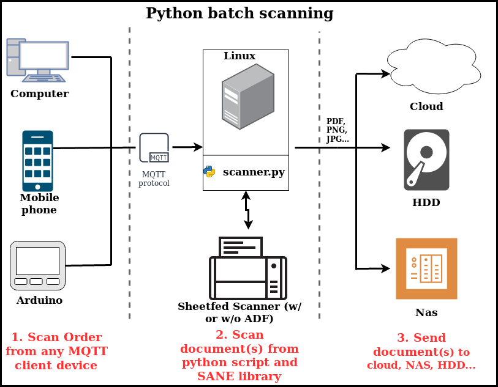
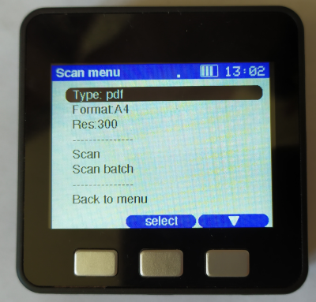

# Python batch scanning

The aim of this project is to automate, under Linux, document scanning and conversion to the chosen format. With a sheetfed scanner, it can manage batch scaninng and multi-pages PDF.

**The project is divided into two parts:**
- [python-scanner/](/python-scanner/): Python script, acting as server and controlling the scanner via the SANE library. It receives orders from a MQTT client device (computer, mobile phone, microcontroller...).
- [m5stack-arduino-client/](/m5stack-arduino-client/): example of client device using M5stack microcontroller (ESP32 + LCD + buttons).

**Requirements for python script:**
* Linux with Python 3.
* Sheetfed scanner working with SANE library.
* MQTT broker available.

**Note:** A flatbed scanner can be used but in this case, script does not manage batch scanning and multi-pages PDF. The script was developed using a Brother DS-620 sheetfed scanner. It may need to be modified to work with other scanners.

**Image of the m5stack device controlling the python script**
 

